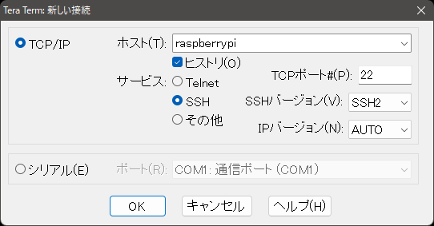
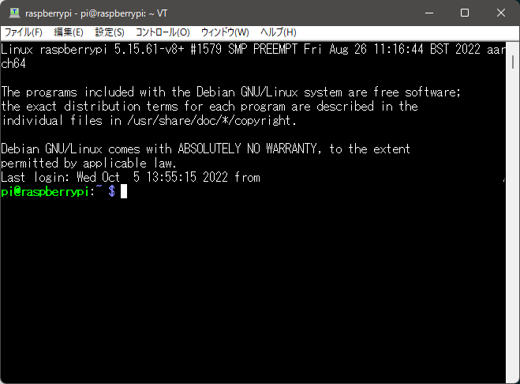

# Raspberry Pi OSの基本的な設定

## ssh接続を行う

ここでは`TeraTerm`を用います。他の`SSH`クライアントでも構いません。

mDNSが正常に動作している環境であれば、以下で接続が可能です。
あるホストに初めて接続する場合、セキュリティ警告が必ず出ます。続行をクリックします。

^

ユーザ名とパスワードが求められますので、`Raspberry Pi Imager`で設定したユーザ名とパスワードでログインします。

^

以降、`TeraTerm`に入力する内容のみを記載します。

## パッケージの更新

以下で`apt`パッケージリストの更新、パッケージのアップグレードを行います。

```bash
sudo apt update && sudo apt upgrade -y
```
