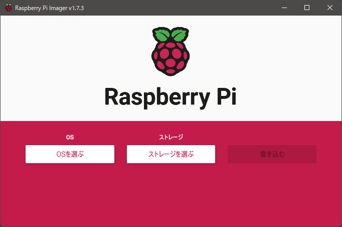
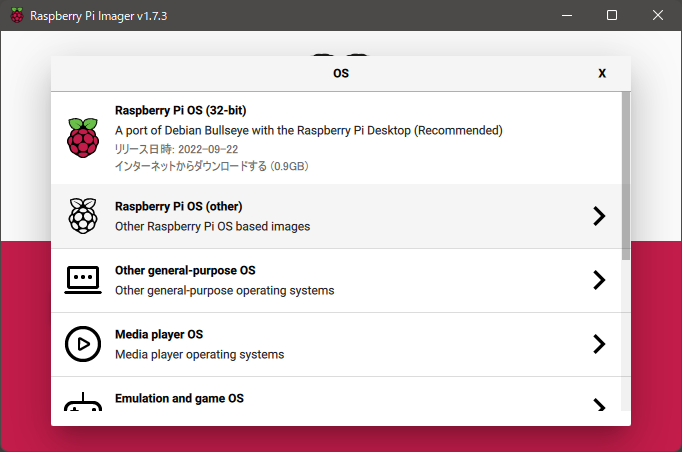
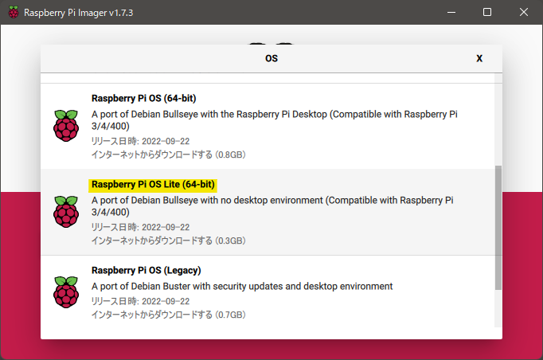
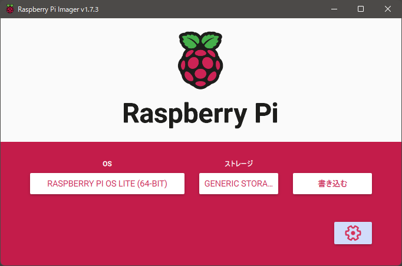
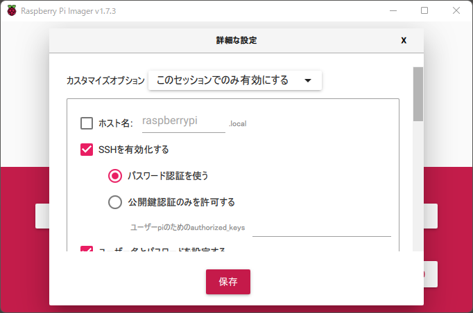
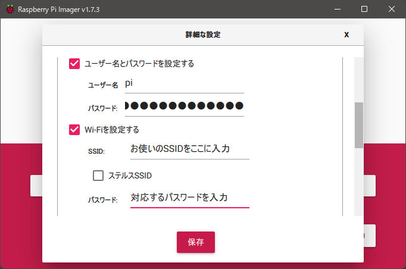
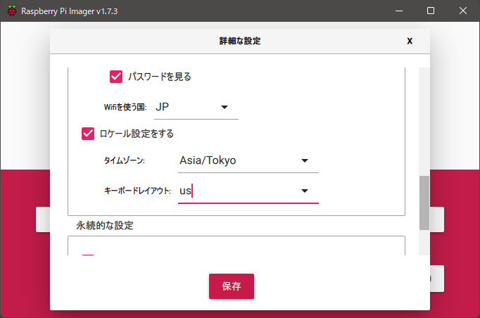
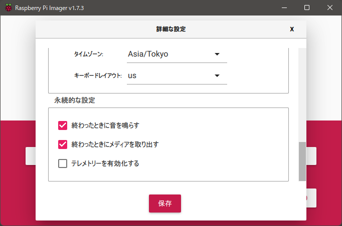

# Raspberry Pi Imagerの使い方

## SDカードにOSイメージを書き込む

ここでは、`Raspberry Pi Imager`を用いてOSを書き込みます。

他にも方法はあるので、他の方法が良い方はそちらで書き込んでください。**ただし、この文書にない手順が追加で必要です。**

### `Raspberry Pi Imager` のインストール

[Raspberry Pi Imager](https://www.raspberrypi.com/software/) からダウンロードし、インストールします。

### `Raspberry Pi Imager` でOSイメージをSDカードに書き込む

#### 起動

起動すると、UAC(管理者権限を求めるウインドウ)が表示されるので、実行を許可しましょう。

起動するとこのような画面が表示されるはずです。

#### OSの選択

まず、OSを選びます。ここでは、`Raspberry Pi OS Lite(64-bit)` を選びます。理由は以下の通りです:

- 情報量が多い (ただし、玉石混交)
- Raspberry Pi 3以降は64bit対応なので、折角なら最大限パフォーマンスを引き出せる64bit OS
- Lite(GUIなし)を選ぶことで、Raspberry Pi側の無駄なリソース消費を可能な限り抑える

実際に選んでいきます。「OSを選ぶ」をクリックして、`Raspberry Pi OS(other)` -> `Raspberry Pi OS Lite(64-bit)` を選択します。

#### 書き込むSDの選択

次に、書き込むストレージを選択します。

「ストレージを選ぶ」をクリックして、ストレージを選びます。この環境では一番上が書き込みたいSDカードなので、これを選択します。

この時点で、このようになっているはずです。

#### 設定を行う

最近簡単な方法が追加されたのでそちらを使います。他にも細かな起動パラメータを調整できる方法がありますので、興味のある方は調べてみてください。

右下にある歯車ボタンをクリックし、以下のように設定を変更します。 **一連の作業が完了するまで保存ボタンは押さないでください。**

ユーザ名は好みのものを、パスワードは極力使い回さず強固なものを設定しておくと良いでしょう。

`Wi-Fiを設定する`は任意ですが、本プロジェクトでは最終に無線接続を行うため、有効にしておきます。お使いのSSIDとパスワードを入力します。

`wifiを使う国`を`JP`にしておきます。国によって電波の法規制が異なります。
また、`ロケール`は`Asia/Tokyo`、キーボードレイアウトは普段お使いのものを選択します。日本語配列であれば`jp`を選択します。

その他の設定項目です。`終わったときにメディアを取り外す`はWindowsでいう安全な取り外しと同様です。完了後即座にSDカードを抜くことが出来ます。

`テレメトリーを有効化する`は、Raspberry Pi Foundationが情報収集することを許可する設定です。[rpi-imager-stats.raspberrypi.com](https://rpi-imager-stats.raspberrypi.com/)に反映されます。

ここでようやく保存して、もとの画面に戻ります。

#### 書き込む

「書き込む」ボタンをクリックすると、確認モーダルが表示されます。書き込むSDカードが誤っていなければ「はい」をクリックします。

SDカードの性能によってまちまちですが、しばらく時間が掛かりますので放置します。(念のため確認も中断せずに行っておきましょう。)

終了後、Windowsの警告音で完了を知らせてくれます。SDカードを取り外しても良いか確認されるので、「続ける」をクリックします。

#### SDカードを抜く

SDカードをPCから取り外しましょう。
